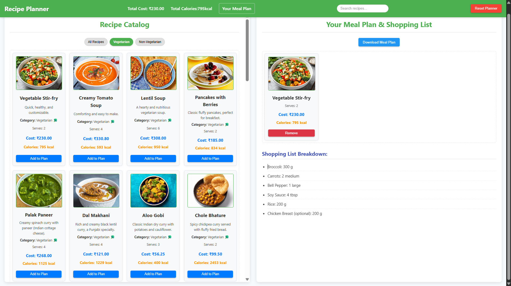
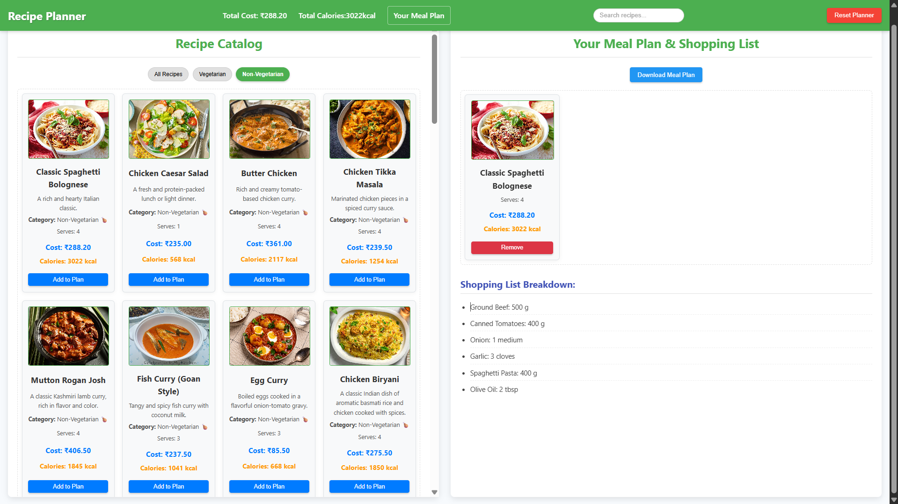
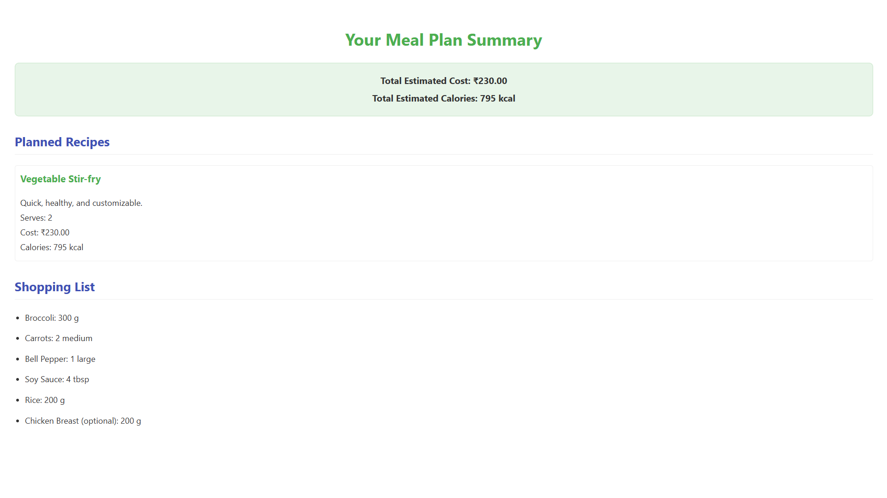

# 🍲 Recipe Planner & Calculator 📊

A dynamic web application designed to help you efficiently plan your meals, estimate costs, calculate calories, and generate consolidated shopping lists. Built with fundamental web technologies, it offers an intuitive interface for managing your culinary week.

## ✨ Features

* **Extensive Recipe Catalog:** Browse through a collection of pre-defined recipes, complete with descriptions, images, serving sizes, categories (Vegetarian/Non-Vegetarian), estimated costs, and calorie counts.
* **Intelligent Filtering & Search:** Easily find recipes by filtering them based on category or by searching using keywords in recipe names, descriptions, or ingredients.
* **Personalized Meal Planning:** Add your favorite recipes from the catalog to build your custom meal plan for the week or any period.
* **Detailed Plan Overview:** View all selected recipes in your meal plan, along with their individual cost and calorie contributions.
* **Automated Totals:** Get an instant summary of the total estimated cost and total calories for your entire meal plan.
* **Consolidated Shopping List:** Automatically generates a comprehensive shopping list based on all planned recipes, combining quantities of common ingredients.
* **Local Persistence:** Your meal plan data is saved in your browser's local storage, ensuring your plan remains intact even if you close and reopen the application.
* **Easy Reset:** Clear your entire meal plan with a single click if you want to start fresh.
* **Flexible Output Options:**
    * **View Plan:** Opens your complete meal plan (including totals and shopping list) in a new browser tab as a beautifully formatted HTML page.
    * **Download Plan:** Downloads your entire meal plan as a self-contained HTML file (`.html`) to your local computer, perfect for offline viewing, sharing, or printing.

---

## 📸 Screenshots

Here are some glimpses of the Recipe Planner & Calculator in action:

**1. Main Recipe Catalog / Dashboard**

**2. Meal Plan Overview**

**3. Shopping List / Detailed Plan View**

---

## 💻 Technologies Used

* **HTML5:** For the core structure and content of the web pages.
* **CSS3:** For styling the application, making it visually appealing and user-friendly.
* **JavaScript (ES6+):** For all interactive functionalities, data management, calculations, and dynamic content updates.

## ▶️ How to Use Locally

To run this project on your local machine:

1.  **Clone or Download:** Get a copy of the project files to your computer. You can clone the GitHub repository or download it as a ZIP file.
2.  **Open `index.html`:** Navigate to the project folder and simply open the `index.html` file in your preferred web browser. All features will be immediately accessible.
